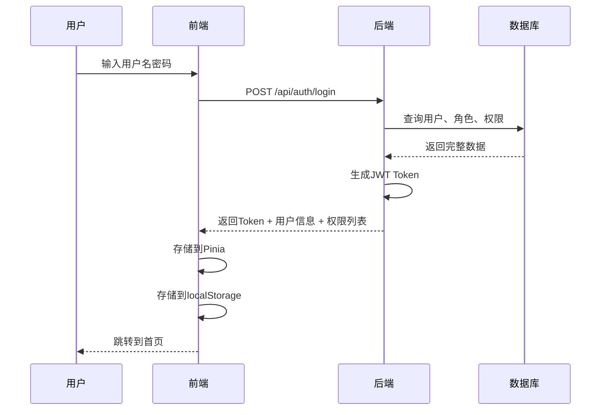

# 朱雀项目 RBAC 权限设计详解

## 📋 权限模型概述

采用基于角色的访问控制（RBAC）模型，包含三个核心层次：

```
用户 (User) → 角色 (Role) → 权限 (Permission)
```

---

## 🗂️ 一、权限分层设计

### 1.1 三层权限控制

```
┌─────────────────────────────────────────────┐
│         第一层：前端路由权限                  │
│         控制用户能看到哪些页面                │
└──────────────────┬──────────────────────────┘
                   │
┌──────────────────▼──────────────────────────┐
│         第二层：按钮级权限                    │
│         控制页面内的操作按钮（新增/删除等）     │
└──────────────────┬──────────────────────────┘
                   │
┌──────────────────▼──────────────────────────┐
│         第三层：后端接口权限                  │
│         控制API的访问（最终防线）              │
└─────────────────────────────────────────────┘
```

### 1.2 权限类型说明

| 权限类型 | 标识 | 用途 | 示例 |
|---------|------|------|------|
| **路由权限** | ROUTE | 前端页面访问控制 | `/advertisers` 访问广告主页面 |
| **按钮权限** | BUTTON | 页面内按钮显示控制 | `advertiser:create` 新增按钮 |
| **接口权限** | API | 后端接口访问控制 | `POST /api/advertisers` |

---

## 🗄️ 二、数据库设计

### 2.1 核心表结构

```sql
-- 用户表
CREATE TABLE `user` (
  `id` BIGINT NOT NULL AUTO_INCREMENT COMMENT '主键ID',
  `username` VARCHAR(50) NOT NULL COMMENT '用户名',
  `password` VARCHAR(100) NOT NULL COMMENT '密码(BCrypt)',
  `real_name` VARCHAR(50) COMMENT '真实姓名',
  `email` VARCHAR(100) COMMENT '邮箱',
  `phone` VARCHAR(20) COMMENT '手机号',
  `status` TINYINT NOT NULL DEFAULT 1 COMMENT '状态 0-禁用 1-启用',
  `create_time` DATETIME NOT NULL DEFAULT CURRENT_TIMESTAMP,
  `update_time` DATETIME NOT NULL DEFAULT CURRENT_TIMESTAMP ON UPDATE CURRENT_TIMESTAMP,
  `deleted` TINYINT NOT NULL DEFAULT 0,
  PRIMARY KEY (`id`),
  UNIQUE KEY `uk_username` (`username`)
) ENGINE=InnoDB DEFAULT CHARSET=utf8mb4 COMMENT='用户表';

-- 角色表
CREATE TABLE `role` (
  `id` BIGINT NOT NULL AUTO_INCREMENT COMMENT '主键ID',
  `role_code` VARCHAR(50) NOT NULL COMMENT '角色编码',
  `role_name` VARCHAR(50) NOT NULL COMMENT '角色名称',
  `description` VARCHAR(200) COMMENT '角色描述',
  `status` TINYINT NOT NULL DEFAULT 1 COMMENT '状态 0-禁用 1-启用',
  `create_time` DATETIME NOT NULL DEFAULT CURRENT_TIMESTAMP,
  `update_time` DATETIME NOT NULL DEFAULT CURRENT_TIMESTAMP ON UPDATE CURRENT_TIMESTAMP,
  `deleted` TINYINT NOT NULL DEFAULT 0,
  PRIMARY KEY (`id`),
  UNIQUE KEY `uk_role_code` (`role_code`)
) ENGINE=InnoDB DEFAULT CHARSET=utf8mb4 COMMENT='角色表';

-- 权限表（统一管理所有类型权限）
CREATE TABLE `permission` (
  `id` BIGINT NOT NULL AUTO_INCREMENT COMMENT '主键ID',
  `parent_id` BIGINT DEFAULT 0 COMMENT '父权限ID',
  `permission_code` VARCHAR(100) NOT NULL COMMENT '权限编码',
  `permission_name` VARCHAR(50) NOT NULL COMMENT '权限名称',
  `permission_type` TINYINT NOT NULL COMMENT '权限类型 1-路由 2-按钮 3-接口',
  `path` VARCHAR(200) COMMENT '路由路径/接口路径',
  `method` VARCHAR(10) COMMENT 'HTTP方法(GET/POST/PUT/DELETE)',
  `sort_order` INT DEFAULT 0 COMMENT '排序',
  `status` TINYINT NOT NULL DEFAULT 1 COMMENT '状态 0-禁用 1-启用',
  `create_time` DATETIME NOT NULL DEFAULT CURRENT_TIMESTAMP,
  `update_time` DATETIME NOT NULL DEFAULT CURRENT_TIMESTAMP ON UPDATE CURRENT_TIMESTAMP,
  `deleted` TINYINT NOT NULL DEFAULT 0,
  PRIMARY KEY (`id`),
  UNIQUE KEY `uk_permission_code` (`permission_code`),
  KEY `idx_permission_type` (`permission_type`)
) ENGINE=InnoDB DEFAULT CHARSET=utf8mb4 COMMENT='权限表';

-- 用户角色关联表
CREATE TABLE `user_role` (
  `id` BIGINT NOT NULL AUTO_INCREMENT COMMENT '主键ID',
  `user_id` BIGINT NOT NULL COMMENT '用户ID',
  `role_id` BIGINT NOT NULL COMMENT '角色ID',
  `create_time` DATETIME NOT NULL DEFAULT CURRENT_TIMESTAMP,
  PRIMARY KEY (`id`),
  UNIQUE KEY `uk_user_role` (`user_id`, `role_id`),
  KEY `idx_user_id` (`user_id`),
  KEY `idx_role_id` (`role_id`)
) ENGINE=InnoDB DEFAULT CHARSET=utf8mb4 COMMENT='用户角色关联表';

-- 角色权限关联表
CREATE TABLE `role_permission` (
  `id` BIGINT NOT NULL AUTO_INCREMENT COMMENT '主键ID',
  `role_id` BIGINT NOT NULL COMMENT '角色ID',
  `permission_id` BIGINT NOT NULL COMMENT '权限ID',
  `create_time` DATETIME NOT NULL DEFAULT CURRENT_TIMESTAMP,
  PRIMARY KEY (`id`),
  UNIQUE KEY `uk_role_permission` (`role_id`, `permission_id`),
  KEY `idx_role_id` (`role_id`),
  KEY `idx_permission_id` (`permission_id`)
) ENGINE=InnoDB DEFAULT CHARSET=utf8mb4 COMMENT='角色权限关联表';

-- 菜单表（前端菜单展示，从权限表派生）
CREATE TABLE `menu` (
  `id` BIGINT NOT NULL AUTO_INCREMENT COMMENT '主键ID',
  `parent_id` BIGINT DEFAULT 0 COMMENT '父菜单ID',
  `menu_name` VARCHAR(50) NOT NULL COMMENT '菜单名称',
  `menu_type` TINYINT NOT NULL COMMENT '菜单类型 1-目录 2-菜单 3-按钮',
  `icon` VARCHAR(50) COMMENT '菜单图标',
  `path` VARCHAR(200) COMMENT '路由路径',
  `component` VARCHAR(200) COMMENT '组件路径',
  `permission_code` VARCHAR(100) COMMENT '权限编码',
  `sort_order` INT DEFAULT 0 COMMENT '排序',
  `visible` TINYINT NOT NULL DEFAULT 1 COMMENT '是否显示 0-隐藏 1-显示',
  `status` TINYINT NOT NULL DEFAULT 1 COMMENT '状态 0-禁用 1-启用',
  `create_time` DATETIME NOT NULL DEFAULT CURRENT_TIMESTAMP,
  `update_time` DATETIME NOT NULL DEFAULT CURRENT_TIMESTAMP ON UPDATE CURRENT_TIMESTAMP,
  `deleted` TINYINT NOT NULL DEFAULT 0,
  PRIMARY KEY (`id`),
  KEY `idx_parent_id` (`parent_id`),
  KEY `idx_permission_code` (`permission_code`)
) ENGINE=InnoDB DEFAULT CHARSET=utf8mb4 COMMENT='菜单表';
```

### 2.2 初始化数据示例

```sql
-- 初始化角色
INSERT INTO `role` (`role_code`, `role_name`, `description`) VALUES
('SUPER_ADMIN', '超级管理员', '拥有所有权限'),
('ADMIN', '管理员', '拥有大部分权限'),
('OPERATOR', '运营人员', '拥有业务操作权限'),
('ADVERTISER', '广告主', '只读权限');

-- 初始化权限（路由类型）
INSERT INTO `permission` (`permission_code`, `permission_name`, `permission_type`, `path`) VALUES
('dashboard', '数据看板', 1, '/dashboard'),
('advertiser:list', '广告主管理', 1, '/advertisers'),
('campaign:list', '推广活动管理', 1, '/campaigns'),
('creative:list', '创意管理', 1, '/creatives'),
('rtb:monitor', '竞价监控', 1, '/rtb/monitor');

-- 初始化权限（按钮类型）
INSERT INTO `permission` (`permission_code`, `permission_name`, `permission_type`) VALUES
('advertiser:create', '新增广告主', 2),
('advertiser:update', '编辑广告主', 2),
('advertiser:delete', '删除广告主', 2),
('advertiser:audit', '审核广告主', 2),
('campaign:create', '新增活动', 2),
('campaign:update', '编辑活动', 2),
('campaign:delete', '删除活动', 2);

-- 初始化权限（接口类型）
INSERT INTO `permission` (`permission_code`, `permission_name`, `permission_type`, `path`, `method`) VALUES
('api:advertiser:list', '查询广告主列表', 3, '/api/advertisers', 'GET'),
('api:advertiser:create', '创建广告主', 3, '/api/advertisers', 'POST'),
('api:advertiser:update', '更新广告主', 3, '/api/advertisers/*', 'PUT'),
('api:advertiser:delete', '删除广告主', 3, '/api/advertisers/*', 'DELETE'),
('api:campaign:list', '查询活动列表', 3, '/api/campaigns', 'GET'),
('api:campaign:create', '创建活动', 3, '/api/campaigns', 'POST');

-- 超级管理员拥有所有权限
INSERT INTO `role_permission` (`role_id`, `permission_id`)
SELECT 1, id FROM `permission` WHERE `deleted` = 0;
```

---

## 🔐 三、后端权限实现

### 3.1 自定义权限注解

```java
package com.zhuque.common.security.annotation;

import java.lang.annotation.*;

/**
 * 权限注解
 */
@Target({ElementType.METHOD, ElementType.TYPE})
@Retention(RetentionPolicy.RUNTIME)
@Documented
public @interface RequiresPermission {

    /**
     * 权限编码（支持多个）
     * 示例：{"advertiser:create", "advertiser:update"}
     */
    String[] value() default {};

    /**
     * 权限逻辑关系
     * true: AND（需要所有权限）
     * false: OR（满足任意一个即可）
     */
    boolean logical() default false;
}
```

### 3.2 权限拦截器

```java
package com.zhuque.common.security.interceptor;

import com.zhuque.common.core.domain.Result;
import com.zhuque.common.core.domain.model.LoginUser;
import com.zhuque.common.security.annotation.RequiresPermission;
import com.zhuque.common.security.utils.SecurityUtils;
import lombok.extern.slf4j.Slf4j;
import org.springframework.stereotype.Component;
import org.springframework.web.method.HandlerMethod;
import org.springframework.web.servlet.HandlerInterceptor;

import javax.servlet.http.HttpServletRequest;
import javax.servlet.http.HttpServletResponse;
import java.util.Set;

/**
 * 权限校验拦截器
 */
@Slf4j
@Component
public class PermissionInterceptor implements HandlerInterceptor {

    @Override
    public boolean preHandle(HttpServletRequest request,
                           HttpServletResponse response,
                           Object handler) throws Exception {

        // 1. 如果不是方法处理器，直接放行
        if (!(handler instanceof HandlerMethod)) {
            return true;
        }

        HandlerMethod handlerMethod = (HandlerMethod) handler;

        // 2. 检查方法上是否有 @RequiresPermission 注解
        RequiresPermission requiredPermission =
            handlerMethod.getMethodAnnotation(RequiresPermission.class);

        // 3. 如果没有注解，检查类级别的注解
        if (requiredPermission == null) {
            requiredPermission = handlerMethod.getBeanType()
                .getAnnotation(RequiresPermission.class);
        }

        // 4. 如果没有权限注解，直接放行
        if (requiredPermission == null) {
            return true;
        }

        // 5. 获取当前登录用户
        LoginUser loginUser = SecurityUtils.getLoginUser();
        if (loginUser == null) {
            setResponse(response, 401, "未登录");
            return false;
        }

        // 6. 获取用户权限列表
        Set<String> userPermissions = loginUser.getPermissions();

        // 7. 检查权限
        String[] requiredPermissions = requiredPermission.value();
        boolean logical = requiredPermission.logical(); // true=AND, false=OR

        boolean hasPermission = checkPermission(userPermissions,
                                                 requiredPermissions,
                                                 logical);

        if (!hasPermission) {
            log.warn("用户{}无权限访问{}", loginUser.getUsername(),
                    request.getRequestURI());
            setResponse(response, 403, "无权限访问");
            return false;
        }

        return true;
    }

    /**
     * 检查权限
     */
    private boolean checkPermission(Set<String> userPermissions,
                                    String[] requiredPermissions,
                                    boolean logical) {
        if (logical) {
            // AND: 需要拥有所有权限
            for (String permission : requiredPermissions) {
                if (!userPermissions.contains(permission)) {
                    return false;
                }
            }
            return true;
        } else {
            // OR: 拥有任意一个权限即可
            for (String permission : requiredPermissions) {
                if (userPermissions.contains(permission)) {
                    return true;
                }
            }
            return false;
        }
    }

    private void setResponse(HttpServletResponse response,
                            int code, String msg) throws Exception {
        response.setContentType("application/json;charset=UTF-8");
        response.setStatus(code);
        Result<Void> result = Result.fail(code, msg);
        response.getWriter().write(JsonUtil.toJson(result));
    }
}
```

### 3.3 Controller 使用示例

```java
package com.zhuque.web.controller;

import com.zhuque.common.core.domain.Result;
import com.zhuque.common.security.annotation.RequiresPermission;
import com.zhuque.model.dto.AdvertiserCreateDTO;
import com.zhuque.model.vo.AdvertiserVO;
import com.zhuque.service.api.AdvertiserService;
import org.springframework.beans.factory.annotation.Autowired;
import org.springframework.web.bind.annotation.*;

/**
 * 广告主管理
 */
@RestController
@RequestMapping("/api/advertisers")
@RequiresPermission("advertiser:list") // 类级别：访问此控制器需要广告主列表权限
public class AdvertiserController {

    @Autowired
    private AdvertiserService advertiserService;

    /**
     * 查询广告主列表
     */
    @GetMapping
    @RequiresPermission("api:advertiser:list") // 方法级别权限优先级更高
    public Result<IPage<AdvertiserVO>> list(@RequestBody AdvertiserQueryDTO dto) {
        IPage<AdvertiserVO> page = advertiserService.pageQuery(dto);
        return Result.success(page);
    }

    /**
     * 创建广告主
     */
    @PostMapping
    @RequiresPermission("api:advertiser:create")
    public Result<Long> create(@Validated @RequestBody AdvertiserCreateDTO dto) {
        Long id = advertiserService.create(dto);
        return Result.success(id);
    }

    /**
     * 更新广告主
     */
    @PutMapping("/{id}")
    @RequiresPermission({"advertiser:update", "api:advertiser:update"}) // 支持多个权限
    public Result<Void> update(@PathVariable Long id,
                              @RequestBody AdvertiserUpdateDTO dto) {
        advertiserService.update(id, dto);
        return Result.success();
    }

    /**
     * 删除广告主
     */
    @DeleteMapping("/{id}")
    @RequiresPermission("advertiser:delete")
    public Result<Void> delete(@PathVariable Long id) {
        advertiserService.delete(id);
        return Result.success();
    }

    /**
     * 审核广告主
     */
    @PutMapping("/{id}/audit")
    @RequiresPermission(value = {"advertiser:audit", "api:advertiser:update"},
                       logical = true) // 需要同时拥有两个权限
    public Result<Void> audit(@PathVariable Long id,
                             @RequestBody AdvertiserAuditDTO dto) {
        advertiserService.audit(id, dto);
        return Result.success();
    }
}
```

### 3.4 登录时加载用户权限

```java
package com.zhuque.service.impl;

import com.zhuque.common.core.domain.model.LoginUser;
import com.zhuque.model.entity.User;
import com.zhuque.model.entity.Role;
import com.zhuque.model.entity.Permission;
import com.zhuque.service.AuthService;
import com.zhuque.service.UserService;
import lombok.extern.slf4j.Slf4j;
import org.springframework.beans.factory.annotation.Autowired;
import org.springframework.security.core.userdetails.UsernameNotFoundException;
import org.springframework.stereotype.Service;

import java.util.HashSet;
import java.util.List;
import java.util.Set;
import java.util.stream.Collectors;

@Slf4j
@Service
public class AuthServiceImpl implements AuthService {

    @Autowired
    private UserService userService;

    @Autowired
    private PermissionService permissionService;

    @Override
    public LoginUser login(String username, String password) {
        // 1. 查询用户
        User user = userService.getByUsername(username);
        if (user == null) {
            throw new UsernameNotFoundException("用户不存在");
        }

        // 2. 校验密码
        if (!SecurityUtils.matchesPassword(password, user.getPassword())) {
            throw new BadCredentialsException("密码错误");
        }

        // 3. 查询用户角色
        List<Role> roles = userService.getRolesByUserId(user.getId());

        // 4. 查询用户权限（包含路由、按钮、接口权限）
        Set<Permission> permissions = permissionService.getPermissionsByUserId(user.getId());

        // 5. 转换为权限编码集合
        Set<String> permissionCodes = permissions.stream()
            .map(Permission::getPermissionCode)
            .collect(Collectors.toSet());

        // 6. 构建LoginUser
        LoginUser loginUser = new LoginUser();
        loginUser.setUser(user);
        loginUser.setRoles(roles);
        loginUser.setPermissions(permissionCodes);

        // 7. 生成JWT Token
        String token = SecurityUtils.createToken(loginUser);
        loginUser.setToken(token);

        return loginUser;
    }
}
```

---

## 🎨 四、前端权限实现

### 4.1 路由权限控制

```typescript
// src/router/index.ts
import { createRouter, createWebHistory, RouteRecordRaw } from 'vue-router'
import { useAuthStore } from '@/stores/auth'

// 路由配置（添加meta字段）
const routes: RouteRecordRaw[] = [
  {
    path: '/login',
    name: 'Login',
    component: () => import('@/views/login/index.vue'),
    meta: { requiresAuth: false } // 登录页不需要认证
  },
  {
    path: '/',
    component: () => import('@/views/layout/index.vue'),
    meta: { requiresAuth: true },
    children: [
      {
        path: 'dashboard',
        name: 'Dashboard',
        component: () => import('@/views/dashboard/index.vue'),
        meta: {
          title: '数据看板',
          icon: 'dashboard',
          permission: 'dashboard' // 需要的路由权限
        }
      },
      {
        path: 'advertisers',
        name: 'AdvertiserList',
        component: () => import('@/views/advertiser/list.vue'),
        meta: {
          title: '广告主管理',
          icon: 'advertiser',
          permission: 'advertiser:list' // 需要的路由权限
        }
      },
      {
        path: 'campaigns',
        name: 'CampaignList',
        component: () => import('@/views/campaign/list.vue'),
        meta: {
          title: '推广活动管理',
          icon: 'campaign',
          permission: 'campaign:list'
        }
      }
    ]
  }
]

const router = createRouter({
  history: createWebHistory(),
  routes
})

// 路由守卫
router.beforeEach((to, from, next) => {
  const authStore = useAuthStore()

  // 1. 检查是否需要登录
  if (to.meta.requiresAuth !== false && !authStore.isLogin) {
    next('/login')
    return
  }

  // 2. 检查路由权限
  if (to.meta.permission) {
    const permissions = authStore.permissions // ['dashboard', 'advertiser:list', ...]
    if (!permissions.includes(to.meta.permission as string)) {
      next('/403') // 无权限，跳转到403页面
      return
    }
  }

  next()
})

export default router
```

### 4.2 按钮权限指令

```typescript
// src/directives/permission.ts
import { useAuthStore } from '@/stores/auth'

/**
 * 权限指令
 * 用法：v-permission="'advertiser:create'"
 *       v-permission="['advertiser:update', 'advertiser:delete']"
 */
export const permission = {
  mounted(el: HTMLElement, binding: DirectiveBinding) {
    const { value } = binding
    const authStore = useAuthStore()
    const permissions = authStore.permissions

    if (value && value instanceof Array && value.length > 0) {
      const hasPermission = value.some((permission: string) => {
        return permissions.includes(permission)
      })

      if (!hasPermission) {
        // 移除DOM元素
        el.parentNode?.removeChild(el)
      }
    } else if (value) {
      if (!permissions.includes(value as string)) {
        el.parentNode?.removeChild(el)
      }
    }
  }
}
```

### 4.3 在组件中使用权限

```vue
<!-- 广告主列表页面 -->
<template>
  <div class="advertiser-list">
    <!-- 工具栏 -->
    <el-toolbar>
      <!-- 新增按钮：需要 advertiser:create 权限 -->
      <el-button
        v-permission="'advertiser:create'"
        type="primary"
        @click="handleCreate">
        <el-icon><Plus /></el-icon>
        新增广告主
      </el-button>

      <!-- 批量删除按钮：需要 advertiser:delete 权限 -->
      <el-button
        v-permission="'advertiser:delete'"
        :disabled="!hasSelection"
        @click="handleBatchDelete">
        <el-icon><Delete /></el-icon>
        批量删除
      </el-button>

      <!-- 导出按钮：需要 advertiser:export 权限 -->
      <el-button
        v-permission="'advertiser:export'"
        @click="handleExport">
        <el-icon><Download /></el-icon>
        导出
      </el-button>
    </el-toolbar>

    <!-- 表格 -->
    <el-table :data="tableData" @selection-change="handleSelectionChange">
      <el-table-column type="selection" width="55" />

      <el-table-column prop="name" label="广告主名称" />

      <el-table-column prop="status" label="状态">
        <template #default="{ row }">
          <el-tag :type="row.status === 1 ? 'success' : 'danger'">
            {{ row.status === 1 ? '启用' : '禁用' }}
          </el-tag>
        </template>
      </el-table-column>

      <el-table-column label="操作" width="250">
        <template #default="{ row }">
          <!-- 查看按钮：所有人可见 -->
          <el-button link type="primary" @click="handleView(row)">
            查看
          </el-button>

          <!-- 编辑按钮：需要 advertiser:update 权限 -->
          <el-button
            v-permission="'advertiser:update'"
            link
            type="primary"
            @click="handleEdit(row)">
            编辑
          </el-button>

          <!-- 审核按钮：需要 advertiser:audit 权限 -->
          <el-button
            v-permission="'advertiser:audit'"
            link
            type="warning"
            @click="handleAudit(row)">
            审核
          </el-button>

          <!-- 删除按钮：需要 advertiser:delete 权限 -->
          <el-button
            v-permission="'advertiser:delete'"
            link
            type="danger"
            @click="handleDelete(row)">
            删除
          </el-button>
        </template>
      </el-table-column>
    </el-table>
  </div>
</template>

<script setup lang="ts">
import { ref } from 'vue'
import { useAuthStore } from '@/stores/auth'

const authStore = useAuthStore()

// 检查是否有某个权限（在JS中使用）
const hasPermission = (permission: string) => {
  return authStore.permissions.includes(permission)
}

// 方法内部权限判断
const handleExport = () => {
  if (!hasPermission('advertiser:export')) {
    ElMessage.error('无导出权限')
    return
  }
  // 执行导出逻辑
}
</script>
```

### 4.4 动态菜单渲染

```typescript
// src/layout/components/Sidebar.vue
<template>
  <el-menu :default-active="activeMenu" router>
    <template v-for="menu in menuList" :key="menu.id">
      <!-- 有子菜单的情况 -->
      <el-sub-menu v-if="menu.children && menu.children.length > 0" :index="menu.path">
        <template #title>
          <el-icon v-if="menu.icon"><component :is="menu.icon" /></el-icon>
          <span>{{ menu.menuName }}</span>
        </template>

        <!-- 递归渲染子菜单 -->
        <template v-for="child in menu.children" :key="child.id">
          <menu-item :menu="child" />
        </template>
      </el-sub-menu>

      <!-- 无子菜单的情况 -->
      <el-menu-item v-else :index="menu.path">
        <el-icon v-if="menu.icon"><component :is="menu.icon" /></el-icon>
        <span>{{ menu.menuName }}</span>
      </el-menu-item>
    </template>
  </el-menu>
</template>

<script setup lang="ts">
import { ref, onMounted } from 'vue'
import { useAuthStore } from '@/stores/auth'
import { getMenuList } from '@/api/menu'

const authStore = useAuthStore()
const menuList = ref<Menu[]>([])

onMounted(async () => {
  // 获取用户的菜单列表（后端根据权限过滤）
  const res = await getMenuList()
  menuList.value = res.data
})
</script>
```

---

## 🔗 五、前后端权限联动

### 5.1 登录流程



### 5.2 权限数据结构

```json
{
  "code": 200,
  "data": {
    "token": "eyJhbGciOiJIUzI1NiIsInR5cCI6IkpXVCJ9...",
    "userInfo": {
      "id": 1,
      "username": "admin",
      "realName": "管理员",
      "email": "admin@zhuque.com"
    },
    "roles": [
      {
        "id": 1,
        "roleCode": "SUPER_ADMIN",
        "roleName": "超级管理员"
      }
    ],
    "permissions": [
      "dashboard",
      "advertiser:list",
      "advertiser:create",
      "advertiser:update",
      "advertiser:delete",
      "advertiser:audit",
      "campaign:list",
      "campaign:create",
      "api:advertiser:list",
      "api:advertiser:create",
      "api:advertiser:update",
      "api:advertiser:delete"
    ],
    "menus": [
      {
        "id": 1,
        "menuName": "数据看板",
        "path": "/dashboard",
        "icon": "dashboard",
        "children": []
      },
      {
        "id": 2,
        "menuName": "广告主管理",
        "path": "/advertisers",
        "icon": "advertiser",
        "children": []
      }
    ]
  }
}
```

---

## ⚙️ 六、权限管理界面

### 6.1 角色管理页面

```vue
<!-- 角色管理 - 分配权限 -->
<template>
  <el-dialog v-model="dialogVisible" title="分配权限" width="600px">
    <el-tree
      ref="permissionTreeRef"
      :data="permissionTree"
      :props="treeProps"
      show-checkbox
      node-key="id"
      :default-checked-keys="checkedPermissions"
      @check="handleCheck"
    >
      <template #default="{ node, data }">
        <span class="custom-tree-node">
          <el-tag
            :type="data.permissionType === 1 ? 'success' :
                   data.permissionType === 2 ? 'warning' : 'primary'"
            size="small">
            {{ data.permissionType === 1 ? '路由' :
               data.permissionType === 2 ? '按钮' : '接口' }}
          </el-tag>
          <span>{{ data.permissionName }}</span>
        </span>
      </template>
    </el-tree>

    <template #footer>
      <el-button @click="dialogVisible = false">取消</el-button>
      <el-button type="primary" @click="handleSave">保存</el-button>
    </template>
  </el-dialog>
</template>

<script setup lang="ts">
const permissionTree = ref([
  {
    id: 1,
    permissionName: '广告主管理',
    permissionType: 1,
    children: [
      { id: 11, permissionName: '查看列表', permissionType: 3 },
      { id: 12, permissionName: '新增', permissionType: 2 },
      { id: 13, permissionName: '编辑', permissionType: 2 },
      { id: 14, permissionName: '删除', permissionType: 2 },
      { id: 15, permissionName: '审核', permissionType: 2 }
    ]
  }
])

const checkedPermissions = ref([11, 12, 13, 14, 15])

const handleSave = async () => {
  // 获取选中的权限
  const checkedKeys = permissionTreeRef.value.getCheckedKeys()
  // 保存到后端
  await assignRolePermissions(roleId.value, checkedKeys)
  ElMessage.success('权限分配成功')
}
</script>
```

---

## 📝 七、使用示例

### 7.1 场景1：新增广告主权限

**步骤：**

1. **后端添加权限数据**
```sql
INSERT INTO `permission` (`permission_code`, `permission_name`,
                          `permission_type`, `path`, `method`)
VALUES ('api:advertiser:create', '创建广告主', 3,
        '/api/advertisers', 'POST');
```

2. **后端Controller添加注解**
```java
@PostMapping
@RequiresPermission("api:advertiser:create")
public Result<Long> create(@RequestBody AdvertiserCreateDTO dto) {
    // ...
}
```

3. **前端路由配置**
```typescript
{
  path: 'advertisers',
  meta: { permission: 'advertiser:list' } // 需要列表权限才能访问页面
}
```

4. **前端按钮添加指令**
```vue
<el-button v-permission="'advertiser:create'" @click="handleCreate">
  新增广告主
</el-button>
```

5. **后台分配权限**
- 进入"角色管理"
- 编辑某个角色
- 勾选"创建广告主"权限
- 保存

### 7.2 场景2：审核功能权限

**要求**：只有审核员才能看到和使用审核按钮

```java
@PutMapping("/{id}/audit")
@RequiresPermission("advertiser:audit")
public Result<Void> audit(@PathVariable Long id,
                         @RequestBody AdvertiserAuditDTO dto) {
    advertiserService.audit(id, dto);
    return Result.success();
}
```

```vue
<el-button
  v-permission="'advertiser:audit'"
  type="warning"
  @click="handleAudit(row)">
  审核
</el-button>
```

---

## 🎯 八、权限配置最佳实践

### 8.1 权限命名规范

```
格式：模块:操作:资源

示例：
- advertiser:list      # 广告主列表
- advertiser:create    # 创建广告主
- advertiser:update    # 更新广告主
- advertiser:delete    # 删除广告主
- advertiser:audit     # 审核广告主

- api:advertiser:list  # 接口权限
- btn:advertiser:create # 按钮权限
```

### 8.2 权限粒度建议

| 场景 | 权限粒度 | 示例 |
|-----|---------|------|
| **小型应用** | 粗粒度 | 只控制到模块级（如：广告主管理） |
| **中型应用** | 中粒度 | 控制到操作级（如：广告主新增、编辑） |
| **大型应用** | 细粒度 | 控制到数据级（如：只能管理自己创建的广告主） |

### 8.3 权限继承关系

```
超级管理员
    └── 自动拥有所有权限（通过role_code = 'SUPER_ADMIN'判断）

管理员
    └── 继承大部分权限，排除敏感操作（如：删除角色）

运营人员
    └── 只有业务操作权限（创建、编辑）

广告主
    └── 只有只读权限（查看报表）
```

---

## 📊 九、权限调试与监控

### 9.1 日志记录

```java
@Slf4j
@Component
public class PermissionInterceptor implements HandlerInterceptor {

    @Override
    public boolean preHandle(HttpServletRequest request,
                           HttpServletResponse response,
                           Object handler) throws Exception {
        // ... 权限检查逻辑 ...

        if (!hasPermission) {
            // 记录无权限访问日志
            log.warn("无权限访问 - 用户:{}, 角色:{}, 接口:{}, 需要权限:{}",
                    loginUser.getUsername(),
                    loginUser.getRoles(),
                    request.getRequestURI(),
                    requiredPermissions);
            setResponse(response, 403, "无权限访问");
            return false;
        }

        return true;
    }
}
```

### 9.2 前端权限调试

```typescript
// 开发环境下打印权限信息
if (import.meta.env.DEV) {
  console.group('🔑 权限信息')
  console.log('用户角色:', authStore.roles)
  console.log('用户权限:', authStore.permissions)
  console.log('路由权限:', router.getRoutes().map(r => r.meta?.permission))
  console.groupEnd()
}
```

---

## ✅ 十、总结

### 关键点

1. **三层权限控制**
   - 前端路由（控制页面访问）
   - 前端按钮（控制操作显示）
   - 后端接口（最终安全防线）

2. **权限统一管理**
   - 所有权限存储在`permission`表
   - 通过`permission_type`区分类型
   - 角色与权限多对多关联

3. **前后端联动**
   - 登录时一次性加载所有权限
   - 前端根据权限动态渲染
   - 后端拦截器校验接口权限

4. **灵活性**
   - 支持权限组合（AND/OR）
   - 支持类级别和方法级别注解
   - 支持通过配置动态调整

### 开发流程

1. **设计权限**：确定需要的权限点
2. **数据库初始化**：插入权限数据
3. **后端实现**：添加注解和拦截器
4. **前端实现**：路由守卫 + 指令
5. **分配权限**：通过管理界面分配
6. **测试验证**：前后端联调

---

**文档版本**: v1.0
**创建日期**: 2025-01-05
**适用项目**: 朱雀广告平台v2
